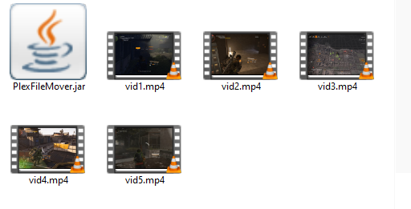
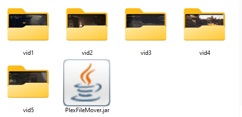
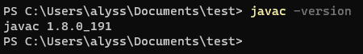
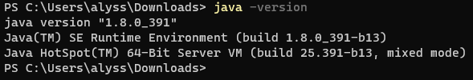
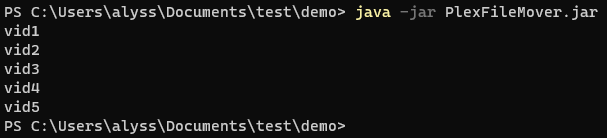

# PlexFileMover

Do you own a large Plex server filled with hundreds or even thousands of movies/TV shows? In the Plex community, it is known that you should move each video into its own folder to keep things like subtitles and posters together. But wouldn't that take too much time?
If you use my PlexFileMover tool, you can save _hours_ of creating and moving files, as it will do it all in minutes at most. 

## How it works
Let's say that this is your server before running the program: 
 
You would like these videos into their own folders, right? Here is the result, which was complete in approximately 2 seconds on a 64-bit Windows 11 machine: 
 
Note that the `PlexFileMover.jar` file is purposefully left out so that you can easily find it again. Obviously, this is a _small_ example. I ran the same program on my father's Plex server with thousands of movies, and it took about two minutes to complete.

## Installation
This is intended for those who have basic knowledge of terminal use. First, you will need to download an up-to-date JDK kit (Java Developer Kit) so that you can run jar files in the command prompt. Find the latest <a href="https://www.oracle.com/java/technologies/downloads/#jdk21-windows">here.</a> 

If you've successfully installed JDK, typing `javac -version` into your terminal should give you the current version that you have:
 
If you want to be extra sure, you can also make sure that you have the Java runtime environment installed with the `java -version` command:
 

Put the `PlexFileMover.jar` file into the same location as your Plex server. Then open the terminal in the same place and type in this command: `java -jar PlexFileMover.jar`. Once that's done, the name of each file that's been moved will appear in the console in real time to keep you up-to-date on the progress. You can check each new directory to make sure that the corresponding file is indeed in that folder. As long as each file such as the subtitles has the same name as its corresponding movie, you should find it all in that folder.

